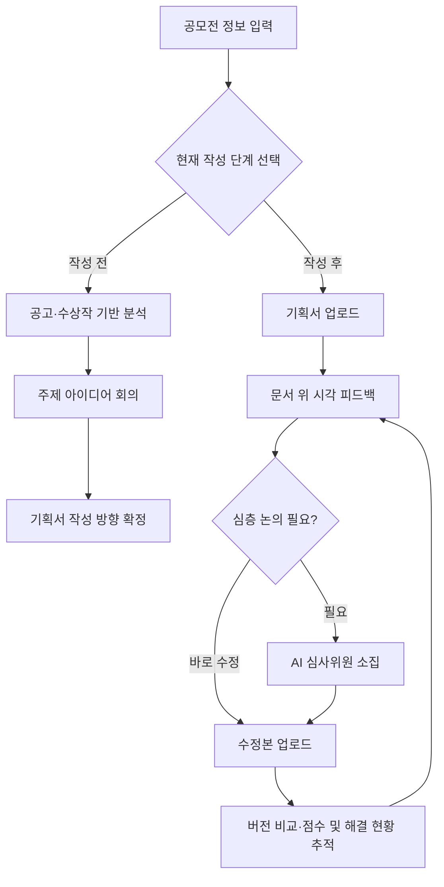

# Review Board 서비스 방향성 정리

> 작성일: 2026-07-20  
> 핵심 정의: **공모전 준비의 전 과정에서, 근거 기반 분석·문서 위 시각 피드백·수정 이력 추적을 제공하는 AI 심사위원 워크벤치**

## 0. MVP 범위와 확장 원칙

### 초기 MVP

- **공모전 도메인:** IT 공모전 중심. 기술·서비스·앱·플랫폼·디지털 전환 등 IT 성격의 공모전을 우선 지원한다.
- **AI 위원:** 2명으로 시작한다.
  - **기획 위원:** 공고문의 심사기준을 우선 고려해 문제 정의, 사용자 가치, 차별성, 사업·서비스 구조, 발표·서술의 설득력을 본다.
  - **개발 위원:** 공고문의 심사기준을 우선 고려해 기술 구현 가능성, 기술 차별성, 데이터·아키텍처·보안·운영 리스크, 검증 계획을 본다.

### 확장 원칙

- AI 위원은 고정된 두 명으로 끝내지 않고, 공모전 도메인과 평가 기준에 맞춰 추가할 수 있게 설계한다. 예: 정책·공공성 위원, 디자인 위원, 재무·사업성 위원.
- 도메인도 IT 공모전에서 먼저 품질을 검증한 뒤 창업, 공공정책, 디자인, 지역문제 해결 등 다른 분야 공모전으로 확장한다.
- 확장 시에는 위원의 말투만 추가하지 않는다. **도메인별 공고문·수상작 데이터·평가 루브릭·검색 프로필을 함께 추가**해 전문성을 확보한다.

> 즉, 초기에는 ‘IT 공모전 + 기획 위원 + 개발 위원’에 집중하고, 구조는 여러 도메인과 위원 구성이 자연스럽게 붙을 수 있게 만든다.

### 심사기준 활용 원칙

- 공고문에 심사기준·배점·평가 방향이 있으면, 두 위원은 해당 기준을 각 의견과 점수의 최우선 근거로 사용한다.
- 모든 피드백에는 연결된 심사기준과 근거 문구를 표시한다. 예: `심사기준: 기술성 30점`, `근거: 구현 구조와 검증 계획이 구체적이지 않음`.
- 심사기준 정보가 없다면, 공고문의 목적·제출 항목·수상작 경향을 먼저 근거로 삼고, 부족한 부분은 IT 제안서의 일반 평가 관점으로 보완한다.
- 이 경우 결과 화면에 **“공식 심사기준 미확인: 아래 평가는 공고문 목적과 일반 IT 제안 평가 관점을 적용한 참고 분석입니다.”**라고 명시한다.

## 1. 사용자 진입 경로: 두 가지 모드

사용자는 시작 화면에서 현재 상태를 고른다. 두 흐름은 같은 공모전 데이터와 평가 기준을 사용하지만, 사용자에게 제공하는 경험은 다르다.

| 모드 | 사용자 상황 | 핵심 경험 | 결과물 |
| --- | --- | --- | --- |
| **작성 전 — 주제 발굴 모드** | 기획서를 아직 쓰지 않았거나 아이디어가 막연함 | 공모전 분석 → 전략 포인트 도출 → AI 위원과 주제 아이디어 회의 | 추천 주제, 선정 이유, 작성 방향, 다음 질문 |
| **작성 후 — 문서 피드백 모드** | 기획서 초안 또는 완성본이 있음 | 문서 분석 → 시각적 피드백·점수·수정 우선순위 제공 | 문단별 코멘트, 평가 요약, 수정 체크리스트 |

---

## 2. 작성 전: 공모전 분석과 주제 아이디어 회의

### 흐름

1. 사용자가 공모전 공고 URL 또는 PDF를 입력한다.
2. 시스템이 공고문과 축적된 수상작 데이터를 분석한다.
3. 공모전의 핵심 의도, 평가 포인트, 주의 조건, 잘 맞는 주제 경향을 짧고 명확하게 제시한다.
4. 사용자가 자신의 관심사·역량·보유 자원에 답하면 AI 위원이 질문을 이어가며 주제 후보를 함께 좁힌다.
5. 회의가 끝나면 선택한 주제와 ‘왜 이 주제가 이 공모전에 맞는지’를 정리해 기획서 작성의 출발점으로 넘긴다.

### 공모전 기본 분석에서 꼭 보여줄 것

- **이 공모전이 진짜로 원하는 문제와 변화**: 표면적인 주제어가 아닌 공고의 정책·사업 목적
- **평가에서 가장 크게 갈리는 지점**: 배점, 심사 기준, 실행 가능성·공공성·차별성 등
- **제안 시 반드시 지켜야 할 조건**: 참가 자격, 제출 형식, 일정, 제한 사항
- **수상작에서 읽히는 경향**: 자주 선택된 문제, 해결 방식, 수상 등급별 완성도 차이
- **전략 제안**: ‘이런 주제가 먹힌다’는 단정이 아니라, 수집 자료를 근거로 한 주제 방향과 차별화 포인트

### AI 위원 회의의 역할

회의는 단순히 아이디어를 여러 개 던지는 기능이 아니다. 사용자가 가진 재료를 공모전 평가 기준에 맞는 하나의 설득력 있는 주제로 만드는 과정이다.

- AI 위원이 사용자에게 순차적으로 질문한다. 예: “이 문제를 실제로 겪은 대상이 누구인가요?”, “현재 보유한 기술·협력처·데이터 중 바로 활용 가능한 것은 무엇인가요?”
- 답변을 바탕으로 주제 후보를 2~3개로 압축하고, 각 후보의 적합성·차별성·실행 리스크를 비교한다.
- 최종 선택 뒤에는 기획서에 바로 옮길 수 있도록 **문제 정의 / 해결안 / 대상 / 기대효과 / 검증 방법**의 초안을 제공한다.
- 초기 IT 공모전에서는 기획 위원이 문제·가치·전략을, 개발 위원이 구현 경로·기술 리스크·검증 가능성을 맡아 서로 다른 관점으로 질문한다.

---

## 3. 작성 후: 기본 피드백과 선택형 심층 회의

작성 후 모드의 기본값은 **회의가 아닌 즉시 피드백**이다. 사용자가 문서를 올리면 기다림 없이 분석 결과를 확인한다.

### 기본 제공: 문서 피드백

- 공모전 기준별 점수와 근거
- 잘된 부분과 보완이 필요한 부분
- 문단·문장 단위의 수정 제안
- 우선순위가 있는 수정 체크리스트
- 근거 자료 또는 공고문 조항 인용

### 선택 제공: AI 심사위원 소집

사용자가 “더 깊이 논의하고 싶다”, “이 지적이 타당한지 반박해 보고 싶다”, “수정 방향을 함께 결정하고 싶다”고 판단할 때만 심층 회의를 연다.

| 기본 피드백 | 심층 회의 소집 |
| --- | --- |
| 빠르게 결과를 확인하고 수정할 때 | 피드백의 이유를 깊게 파고들거나 전략 결정을 해야 할 때 |
| 문단별 코멘트, 점수, 체크리스트 | 위원 간 관점 비교, 사용자 질의·반박, 대안 비교 |
| 비동기형 분석 결과 | 대화형·회의형 경험 |

이 구조로 ‘모든 분석을 굳이 회의로 만들지 않으면서도’, Review Board만의 AI 위원 경험은 필요한 순간에 강하게 제공한다.

---

## 4. 데이터 자산: 수상작·선정 결과 기반 RAG

공고문만 검색하는 서비스가 아니라, **해당 공모전에서 실제로 어떤 아이디어가 선택되었는지**를 근거로 분석한다.

### 우선 저장·구조화할 데이터 예시

| 데이터 | 활용 목적 |
| --- | --- |
| 2026년 수상후보작 17건 | 올해 경쟁작·아이디어 트렌드 파악 |
| 최종 수상작 및 수상 등급 | 등급별 주제·문제정의·실현가능성의 특징 비교 |
| 최근 6개년 최종 선정 결과 | 과거부터 이어진 주제 흐름과 변화 탐색 |
| 공고문·심사기준·변경 대비표 | 당해 연도 조건과 평가 방향의 정확한 근거 제시 |

### 데이터가 답변에 쓰이는 방식

- 분석 결과에는 ‘근거가 된 수상작/공고문’을 함께 표시한다.
- 과거 수상 경향은 **참고 신호**로만 쓴다. 과거 수상작을 흉내 내도록 유도하지 않고, 올해 공고의 변화와 사용자의 차별점을 함께 판단한다.
- 공모전별로 `공고문 → 수상작 → 심사기준 → 사용자 기획서`를 연결해 검색하므로, AI 위원의 조언이 일반론이 아닌 해당 공모전 맥락을 갖게 한다.

---

## 5. 핵심 UI: 시각적 인터랙티브 워크벤치

문서 피드백 화면은 일반 채팅창이 아니라, 실제 심사위원이 문서를 펼쳐 놓고 빨간 펜으로 짚어 주는 경험을 목표로 한다.

### 화면 구성

- **중앙:** 사용자의 기획서 원문
- **문서 위:** AI 심사위원의 형광펜 하이라이트와 메모 핀
- **측면 패널:** 선택한 문단의 상세 코멘트, 근거, 제안 문장, 관련 평가 기준
- **상단:** 버전, 종합 점수, 해결된 지적사항 수, 현재 분석 상태

### 피드백 인터랙션

1. AI가 특정 문단·문장에 하이라이트 또는 메모 핀을 배치한다.
2. 사용자가 표시를 클릭하면 “왜 문제인지 / 어떤 평가 기준과 연결되는지 / 어떻게 고치면 되는지”를 확인한다.
3. 필요할 때 해당 지점에서 바로 AI 위원을 소집해 질문하거나, 대안 문장을 비교한다.
4. 수정 후 새 버전을 올리면 이전 피드백과 연결해 변화가 표시된다.

초기 화면에서는 기획 위원과 개발 위원의 피드백을 구분해 보여 준다. 두 의견이 다를 때는 어느 심사기준을 우선 해석했는지와 각 근거를 나란히 표시해, 사용자가 판단하거나 심층 회의에서 직접 논의할 수 있게 한다.

> 이 화면 자체가 서비스의 차별점이다. 결과 텍스트를 길게 읽는 대신, **문서의 어느 부분을 왜 고쳐야 하는지**를 한눈에 이해하고 바로 행동하게 만든다.

---

## 6. 개인 맞춤형 피드백 루프: 수정 이력 추적

사용자의 문서를 한 번 평가하고 끝내지 않는다. `v1.0 → v1.1 → v2.0`의 수정 흐름을 기억하고, 피드백 반영 결과를 지속적으로 기록한다.

### 버전별로 추적할 항목

- 기준별 점수와 종합 점수 변화
- 이전에 지적된 항목의 상태: 미반영 / 부분 반영 / 해결 / 새 리스크 발생
- 문단 단위 변경 내용과 연결된 피드백
- 반복되는 약점과 개선된 강점
- 다음 버전에서 가장 먼저 처리해야 할 항목

### 사용자에게 보여줄 핵심 질문의 답

- “지난번 지적했던 B 항목은 이번 버전에서 어떻게 보완되었나요?”
- “수정으로 어느 평가 기준의 점수가 얼마나 올랐나요?”
- “아직 해결되지 않은 지적사항은 무엇인가요?”
- “새로 생긴 리스크나 문서 간 모순은 없나요?”

이 기능은 단발성 AI 첨삭이 아니라, 사용자가 피드백을 반영해 성장하는 과정을 함께 관리하는 **개인 맞춤형 피드백 루프**다.

---

## 7. 전체 서비스 흐름

## 8. 팀이 공유할 한 문장

**Review Board는 IT 공모전부터 시작해 기획·개발 AI 위원의 근거 기반 분석으로, 작성 전에는 사용자의 주제를 함께 설계하고 작성 후에는 문서 위에서 피드백과 수정 이력을 추적하는 AI 심사위원 워크벤치다.**
